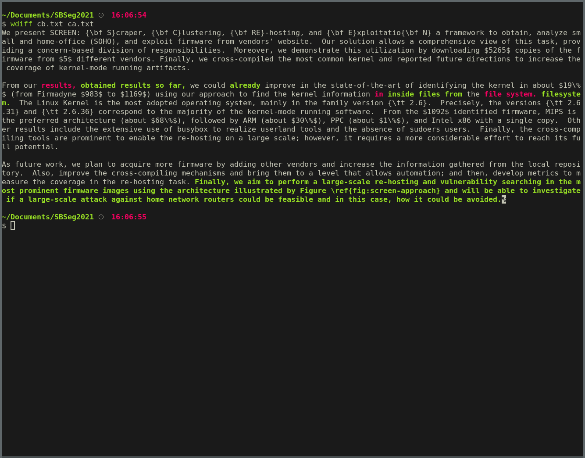

# Conclusão

## Diff

## Before

We present SCREEN: {\bf S}craper, {\bf C}lustering, {\bf RE}-hosting, and {\bf E}xploitatio{\bf N} a framework to obtain, analyze small and home-office (SOHO), and exploit firmware from vendors' website.  Our solution allows a comprehensive view of this task, providing a concern-based division of responsibilities.  Moreover, we demonstrate this utilization by downloading $5265$ copies of the firmware from $5$ different vendors. Finally, we cross-compiled the most common kernel and reported future directions to increase the coverage of kernel-mode running artifacts.

From our results, we could improve in the state-of-the-art of identifying the kernel in about $19\%$ (from Firmadyne $983$ to $1169$) using our approach to find the kernel information in the file system.  The Linux Kernel is the most adopted operating system, mainly in the family version {\tt 2.6}.  Precisely, the versions {\tt 2.6.31} and {\tt 2.6.36} correspond to the majority of the kernel-mode running software.  From the $1092$ identified firmware, MIPS is the preferred architecture (about $68\%$), followed by ARM (about $30\%$), PPC (about $1\%$), and Intel x86 with a single copy.  Other results include the extensive use of busybox to realize userland tools and the absence of sudoers users.  Finally, the cross-compiling tools are prominent to enable the re-hosting on a large scale; however, it requires a more considerable effort to reach its full potential.

As future work, we plan to acquire more firmware by adding other vendors and increase the information gathered from the local repository.  Also, improve the cross-compiling mechanisms and bring them to a level that allows automation; and then, develop metrics to measure the coverage in the re-hosting task.

## After

We present SCREEN: {\bf S}craper, {\bf C}lustering, {\bf RE}-hosting, and {\bf E}xploitatio{\bf N} a framework to obtain, analyze small and home-office (SOHO), and exploit firmware from vendors' website.  Our solution allows a comprehensive view of this task, providing a concern-based division of responsibilities.  Moreover, we demonstrate this utilization by downloading $5265$ copies of the firmware from $5$ different vendors. Finally, we cross-compiled the most common kernel and reported future directions to increase the coverage of kernel-mode running artifacts.

From our obtained results so far, we could already improve in the state-of-the-art of identifying the kernel in about $19\%$ (from Firmadyne $983$ to $1169$) using our approach to find the kernel information inside files from the filesystem.  The Linux Kernel is the most adopted operating system, mainly in the family version {\tt 2.6}.  Precisely, the versions {\tt 2.6.31} and {\tt 2.6.36} correspond to the majority of the kernel-mode running software.  From the $1092$ identified firmware, MIPS is the preferred architecture (about $68\%$), followed by ARM (about $30\%$), PPC (about $1\%$), and Intel x86 with a single copy.  Other results include the extensive use of busybox to realize userland tools and the absence of sudoers users.  Finally, the cross-compiling tools are prominent to enable the re-hosting on a large scale; however, it requires a more considerable effort to reach its full potential.

As future work, we plan to acquire more firmware by adding other vendors and increase the information gathered from the local repository.  Also, improve the cross-compiling mechanisms and bring them to a level that allows automation; and then, develop metrics to measure the coverage in the re-hosting task. Finally, we aim to perform a large-scale re-hosting and vulnerability searching in the most prominent firmware images using the architecture illustrated by Figure \ref{fig:screen-approach} and will be able to investigate if a large-scale attack against home network routers could be feasible and in this case, how it could be avoided.