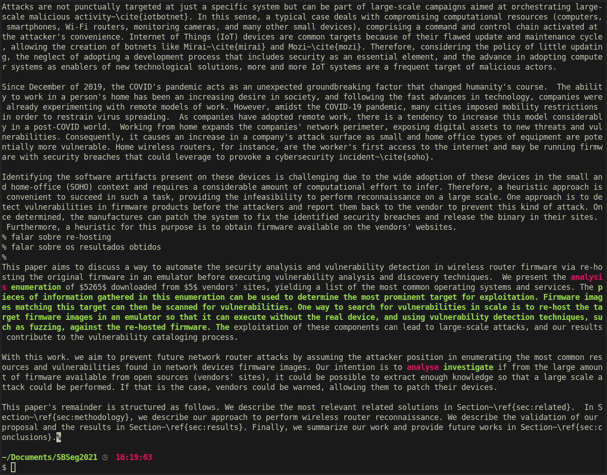

# Introduction

## Diff

## Before

Cybersecurity is a crucial area in our current context and plays a critical role in the strategic points for business continuity~\cite{wef}. According to the World Economic Forum 2021 Global Risk Report~\cite{wefrep2021}, incidents of this nature represent one of the greatest post-pandemic challenges and have the potential to cause economic disruption, financial losses, geopolitical tensions, and social instabilities. Therefore, it is important to emphasize that cybersecurity should be an essential part of the product and service development lifecycle. It is possible to observe that, in the past, cyber attacks were publicized in specialized media; however, due to the digital transformation the world is undergoing, these types of incidents have appeared in vehicles aimed at the general public (eg, JBS in June 2021\footnote{\url{https://www.nytimes.com/2021 /06/01/business/meat-plant-cyberattack-jbs.html}}, USA Pipelines May 2021\footnote{\url{https://www.bbc.com/news/business-57112371}, \url{http:// /www.nytimes.com/2021/05/10/us/politics/dark-side-hack.html}}, TJ-RS in April 2021\footnote{\url{https://g1.globo.com/ rs/rio-grande-do-sul/noticia/2021/04/29/tj-rs-says-that-court's-computer-system-was-target-of-hacker-attack-and-a lot- grave.ghtml}}, STJ in November 2020\footnote{\url{https://www.cisoadvisor.com.br/stj-comunica-superacao-do-incidente-cibernetico-com-ransomware/}}, just for highlight a few). Hence, there is a relationship between cyber attacks and impacts on different areas of activities in the productive sector~\cite{costs}.

Attacks are not punctually targeted at just a specific system but can be part of large-scale campaigns aimed at orchestrating large-scale malicious activity~\cite{iotbotnet}. In this sense, a typical case deals with compromising computational resources (computers, smartphones, Wi-Fi routers, monitoring cameras, and many other small devices), comprising a command and control chain activated at the attacker's convenience. Internet of Things (IoT) devices are common targets because of their flawed update and maintenance cycle, allowing the creation of botnets like Mirai~\cite{mirai} and Mozi~\cite{mozi}. Therefore, considering the policy of little updating, the neglect of adopting a development process that includes security as an essential element, and the advance in adopting computer systems as enablers of new technological solutions, more and more IoT systems are a frequent target of malicious actors.

Since December of 2019, the COVID's pandemic acts as an unexpected groundbreaking factor that changed humanity's course.  The ability to work in a person's home has been an increasing desire in society, and following the fast advances in technology, companies were already experimenting with remote models of work. However, amidst the COVID-19 pandemic, many cities imposed mobility restrictions in order to restrain virus spreading.  As companies have adopted remote work, there is a tendency to increase this model considerably in a post-COVID world.  Working from home expands the companies' network perimeter, exposing digital assets to new threats and vulnerabilities. Consequently, it causes an increase in a company's attack surface as small and home office types of equipment are potentially more vulnerable. Home wireless routers, for instance, are the worker's first access to the internet and may be running firmware with security breaches that could leverage to provoke a cybersecurity incident~\cite{soho}.

Identifying the software artifacts present on these devices is challenging due to the wide adoption of these devices in the small and home-office (SOHO) context and requires a considerable amount of computational effort to infer. Therefore, a heuristic approach is convenient to succeed in such a task, providing the infeasibility to perform reconnaissance on a large scale. One approach is to detect vulnerabilities in firmware products before the attackers and report them back to the vendor to prevent this kind of attack. Once determined, the manufactures can patch the system to fix the identified security breaches and release the binary in their sites.  Furthermore, a heuristic for this purpose is to obtain firmware available on the vendors' websites.  
% falar sobre re-hosting
% falar sobre os resultados obtidos
% 
This paper aims to discuss a way to automate the security analysis and vulnerability detection in wireless router firmware via re-hosting the original firmware in an emulator before executing vulnerability analysis and discovery techniques.  We present the analysis of $5265$ downloaded from $5$ vendors' sites, yielding a list of the most common operating systems and services. The exploitation of these components can lead to large-scale attacks, and our results contribute to the vulnerability cataloging process.

With this work. we aim to prevent future network router attacks by assuming the attacker position in enumerating the most common resources and vulnerabilities found in network devices firmware images. Our intention is to analyse if from the large amount of firmware available from open sources (vendors' sites), it could be possible to extract enough knowledge so that a large scale attack could be performed. If that is the case, vendors could be warned, allowing them to patch their devices.

This paper's remainder is structured as follows. We describe the most relevant related solutions in Section~\ref{sec:related}.  In Section~\ref{sec:methodology}, we describe our approach to perform wireless router reconnaissance. We describe the validation of our proposal and the results in Section~\ref{sec:results}. Finally, we summarize our work and provide future works in Section~\ref{sec:conclusions}.

## After

Cybersecurity is a crucial area in our current context and plays a critical role in the strategic points for business continuity~\cite{wef}. According to the World Economic Forum 2021 Global Risk Report~\cite{wefrep2021}, incidents of this nature represent one of the greatest post-pandemic challenges and have the potential to cause economic disruption, financial losses, geopolitical tensions, and social instabilities. Therefore, it is important to emphasize that cybersecurity should be an essential part of the product and service development lifecycle. It is possible to observe that, in the past, cyber attacks were publicized in specialized media; however, due to the digital transformation the world is undergoing, these types of incidents have appeared in vehicles aimed at the general public (eg, JBS in June 2021\footnote{\url{https://www.nytimes.com/2021 /06/01/business/meat-plant-cyberattack-jbs.html}}, USA Pipelines May 2021\footnote{\url{https://www.bbc.com/news/business-57112371}, \url{http:// /www.nytimes.com/2021/05/10/us/politics/dark-side-hack.html}}, TJ-RS in April 2021\footnote{\url{https://g1.globo.com/ rs/rio-grande-do-sul/noticia/2021/04/29/tj-rs-says-that-court's-computer-system-was-target-of-hacker-attack-and-a lot- grave.ghtml}}, STJ in November 2020\footnote{\url{https://www.cisoadvisor.com.br/stj-comunica-superacao-do-incidente-cibernetico-com-ransomware/}}, just for highlight a few). Hence, there is a relationship between cyber attacks and impacts on different areas of activities in the productive sector~\cite{costs}.

Attacks are not punctually targeted at just a specific system but can be part of large-scale campaigns aimed at orchestrating large-scale malicious activity~\cite{iotbotnet}. In this sense, a typical case deals with compromising computational resources (computers, smartphones, Wi-Fi routers, monitoring cameras, and many other small devices), comprising a command and control chain activated at the attacker's convenience. Internet of Things (IoT) devices are common targets because of their flawed update and maintenance cycle, allowing the creation of botnets like Mirai~\cite{mirai} and Mozi~\cite{mozi}. Therefore, considering the policy of little updating, the neglect of adopting a development process that includes security as an essential element, and the advance in adopting computer systems as enablers of new technological solutions, more and more IoT systems are a frequent target of malicious actors.

Since December of 2019, the COVID's pandemic acts as an unexpected groundbreaking factor that changed humanity's course.  The ability to work in a person's home has been an increasing desire in society, and following the fast advances in technology, companies were already experimenting with remote models of work. However, amidst the COVID-19 pandemic, many cities imposed mobility restrictions in order to restrain virus spreading.  As companies have adopted remote work, there is a tendency to increase this model considerably in a post-COVID world.  Working from home expands the companies' network perimeter, exposing digital assets to new threats and vulnerabilities. Consequently, it causes an increase in a company's attack surface as small and home office types of equipment are potentially more vulnerable. Home wireless routers, for instance, are the worker's first access to the internet and may be running firmware with security breaches that could leverage to provoke a cybersecurity incident~\cite{soho}.

Identifying the software artifacts present on these devices is challenging due to the wide adoption of these devices in the small and home-office (SOHO) context and requires a considerable amount of computational effort to infer. Therefore, a heuristic approach is convenient to succeed in such a task, providing the infeasibility to perform reconnaissance on a large scale. One approach is to detect vulnerabilities in firmware products before the attackers and report them back to the vendor to prevent this kind of attack. Once determined, the manufactures can patch the system to fix the identified security breaches and release the binary in their sites.  Furthermore, a heuristic for this purpose is to obtain firmware available on the vendors' websites.  
% falar sobre re-hosting
% falar sobre os resultados obtidos
% 
This paper aims to discuss a way to automate the security analysis and vulnerability detection in wireless router firmware via re-hosting the original firmware in an emulator before executing vulnerability analysis and discovery techniques.  We present the enumeration of $5265$ downloaded from $5$ vendors' sites, yielding a list of the most common operating systems and services. The pieces of information gathered in this enumeration can be used to determine the most prominent target for exploitation. Firmware images matching this target can then be scanned for vulnerabilities. One way to search for vulnerabilities in scale is to re-host the target firmware images in an emulator so that it can execute without the real device, and using vulnerability detection techniques, such as fuzzing, against the re-hosted firmware. The exploitation of these components can lead to large-scale attacks, and our results contribute to the vulnerability cataloging process.

With this work. we aim to prevent future network router attacks by assuming the attacker position in enumerating the most common resources and vulnerabilities found in network devices firmware images. Our intention is to investigate if from the large amount of firmware available from open sources (vendors' sites), it could be possible to extract enough knowledge so that a large scale attack could be performed. If that is the case, vendors could be warned, allowing them to patch their devices.

This paper's remainder is structured as follows. We describe the most relevant related solutions in Section~\ref{sec:related}.  In Section~\ref{sec:methodology}, we describe our approach to perform wireless router reconnaissance. We describe the validation of our proposal and the results in Section~\ref{sec:results}. Finally, we summarize our work and provide future works in Section~\ref{sec:conclusions}.