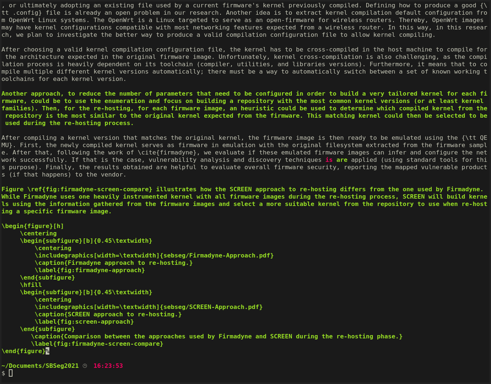

# Re-hosting Process

## Diff

## Before
We aim to maximize the portion of the original firmware during the re-hosting phase, absenting the original hardware. Firmadyne's approach to firmware re-hosting extracts from the original firmware image its original root filesystem and kernel. It then completely ignores the original kernel and replaces it with a custom instrumented kernel designed by the researchers (they developed one instrumented kernel for {\tt ARM} architecture and one for {\tt MIPS} architecture). Finally, the {\tt QEMU} tool is responsible for the emulation process, which uses binary translation to allow the execution of binaries from different architectures. The emulated firmware is emulated with {\tt QEMU} using the instrumented kernel together with the extracted filesystem from the original firmware.

Our approach to firmware re-hosting is similar to Firmadyne's one, with differences regarding the kernel replacement part. Instead of just building one heavily instrumented kernel and replacing all firmware images with that same instrumented kernel, we propose building-specific kernel versions on demand according to the original kernel used by the firmware image under emulation. With that, our heuristics correspond to use a more similar kernel to the original to reduce incompatibility with network drivers and modules and therefore increase the number of emulated firmware with a working network interface. In addition, increasing the emulation coverage allow us to extend the vulnerability analysis and discovery process to a more significant amount of router firmware images than the one covered by the original Firmadyne's implementation.

This process of automated kernel cross-compilation, however, faces many issues. The first one is how to define a valid kernel compile configuration that results in a kernel that has the features expected in router firmware. Kernel compile configuration is a configuration file ({\tt .config}) where the user can configure an extensive list of parameters to include or exclude features to the compiled kernel.

These configuration files can be filled up by the user manually, via answering questions interactively in the command-line interface, or ultimately adopting an existing file used by a current firmware's kernel previously compiled. Defining how to produce a good {\tt .config} file is already an open problem in our research. Another idea is to extract kernel compilation default configuration from OpenWrt Linux systems. The OpenWrt is a Linux targeted to serve as an open-firmware for wireless routers. Thereby, OpenWrt images may have kernel configurations compatible with most networking features expected from a wireless router. In this way, in this research, we plan to investigate the better way to produce a valid compilation configuration file to allow kernel compiling.

After choosing a valid kernel compilation configuration file, the kernel has to be cross-compiled in the host machine to compile for the architecture expected in the original firmware image. Unfortunately, kernel cross-compilation is also challenging, as the compilation process is heavily dependent on its toolchain (compiler, utilities, and libraries versions). Furthermore, it means that to compile multiple different kernel versions automatically; there must be a way to automatically switch between a set of known working toolchains for each kernel version.

After compiling a kernel version that matches the original kernel, the firmware image is then ready to be emulated using the {\tt QEMU}. First, the newly compiled kernel serves as firmware in emulation with the original filesystem extracted from the firmware sample. After that, following the work of \cite{firmadyne}, we evaluate if these emulated firmware images can infer and configure the network successfully. If that is the case, vulnerability analysis and discovery techniques is applied (using standard tools for this purpose). Finally, the results obtained are helpful to evaluate overall firmware security, reporting the mapped vulnerable products (if that happens) to the vendor.

## After

We aim to maximize the portion of the original firmware during the re-hosting phase, absenting the original hardware. Firmadyne's approach to firmware re-hosting extracts from the original firmware image its original root filesystem and kernel. It then completely ignores the original kernel and replaces it with a custom instrumented kernel designed by the researchers (they developed one instrumented kernel for {\tt ARM} architecture and one for {\tt MIPS} architecture). Finally, the {\tt QEMU} tool is responsible for the emulation process, which uses binary translation to allow the execution of binaries from different architectures. The emulated firmware is emulated with {\tt QEMU} using the instrumented kernel together with the extracted filesystem from the original firmware.

Our approach to firmware re-hosting is similar to Firmadyne's one, with differences regarding the kernel replacement part. Instead of just building one heavily instrumented kernel and replacing all firmware images with that same instrumented kernel, we propose building-specific kernel versions on demand according to the original kernel used by the firmware image under emulation. With that, our heuristics correspond to use a more similar kernel to the original to reduce incompatibility with network drivers and modules and therefore increase the number of emulated firmware with a working network interface. In addition, increasing the emulation coverage allow us to extend the vulnerability analysis and discovery process to a more significant amount of router firmware images than the one covered by the original Firmadyne's implementation.

This process of automated kernel cross-compilation, however, faces many issues. The first one is how to define a valid kernel compile configuration that results in a kernel that has the features expected in router firmware. Kernel compile configuration is a configuration file ({\tt .config}) where the user can configure an extensive list of parameters to include or exclude features to the compiled kernel.

These configuration files can be filled up by the user manually, via answering questions interactively in the command-line interface, or ultimately adopting an existing file used by a current firmware's kernel previously compiled. Defining how to produce a good {\tt .config} file is already an open problem in our research. Another idea is to extract kernel compilation default configuration from OpenWrt Linux systems. The OpenWrt is a Linux targeted to serve as an open-firmware for wireless routers. Thereby, OpenWrt images may have kernel configurations compatible with most networking features expected from a wireless router. In this way, in this research, we plan to investigate the better way to produce a valid compilation configuration file to allow kernel compiling.

After choosing a valid kernel compilation configuration file, the kernel has to be cross-compiled in the host machine to compile for the architecture expected in the original firmware image. Unfortunately, kernel cross-compilation is also challenging, as the compilation process is heavily dependent on its toolchain (compiler, utilities, and libraries versions). Furthermore, it means that to compile multiple different kernel versions automatically; there must be a way to automatically switch between a set of known working toolchains for each kernel version.

Another approach, to reduce the number of parameters that need to be configured in order to build a very tailored kernel for each firmware, could be to use the enumeration and focus on building a repository with the most common kernel versions (or at least kernel families). Then, for the re-hosting, for each firmware image, an heuristic could be used to determine which compiled kernel from the repository is the most similar to the original kernel expected from the firmware. This matching kernel could then be selected to be used during the re-hosting process.

After compiling a kernel version that matches the original kernel, the firmware image is then ready to be emulated using the {\tt QEMU}. First, the newly compiled kernel serves as firmware in emulation with the original filesystem extracted from the firmware sample. After that, following the work of \cite{firmadyne}, we evaluate if these emulated firmware images can infer and configure the network successfully. If that is the case, vulnerability analysis and discovery techniques are applied (using standard tools for this purpose). Finally, the results obtained are helpful to evaluate overall firmware security, reporting the mapped vulnerable products (if that happens) to the vendor.

Figure \ref{fig:firmadyne-screen-compare} illustrates how the SCREEN approach to re-hosting differs from the one used by Firmadyne. While Firmadyne uses one heavily instrumented kernel with all firmware images during the re-hosting process, SCREEN will build kernels using the information gathered from the firmware images and select a more suitable kernel from the repository to use when re-hosting a specific firmware image.

\begin{figure}[h]
     \centering
     \begin{subfigure}[b]{0.45\textwidth}
         \centering
         \includegraphics[width=\textwidth]{sebseg/Firmadyne-Approach.pdf}
         \caption{Firmadyne approach to re-hosting.}
         \label{fig:firmadyne-approach}
     \end{subfigure}
     \hfill
     \begin{subfigure}[b]{0.45\textwidth}
         \centering
         \includegraphics[width=\textwidth]{sebseg/SCREEN-Approach.pdf}
         \caption{SCREEN approach to re-hosting.}
         \label{fig:screen-approach}
     \end{subfigure}
        \caption{Comparison between the approaches used by Firmadyne and SCREEN during the re-hosting phase.}
        \label{fig:firmadyne-screen-compare}
\end{figure}