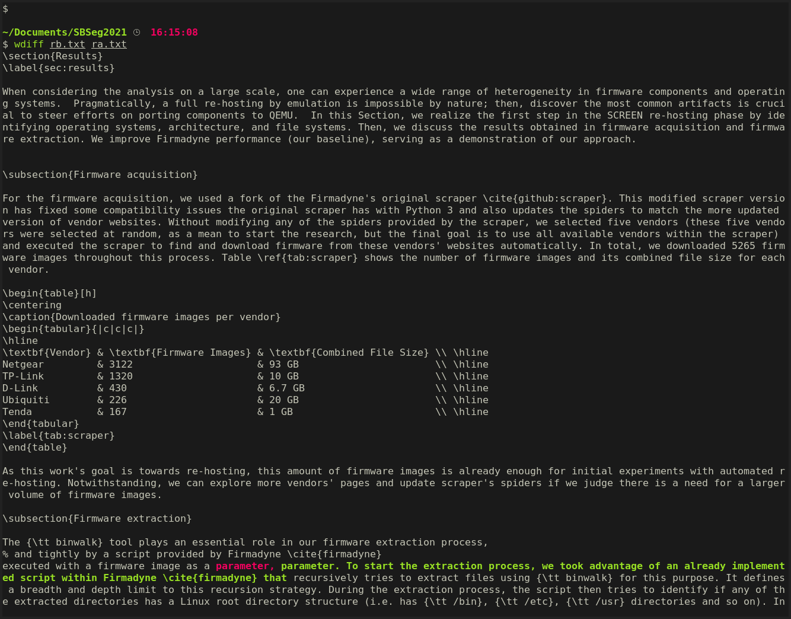
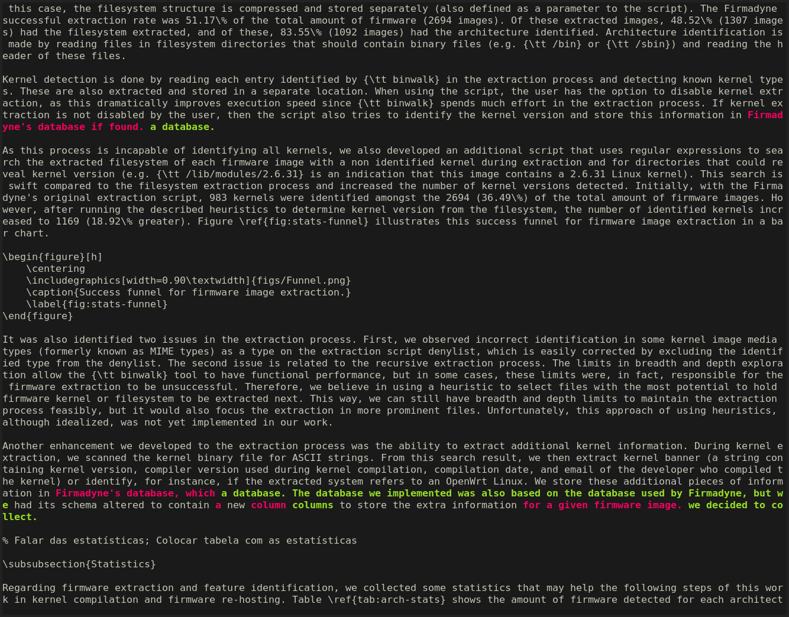
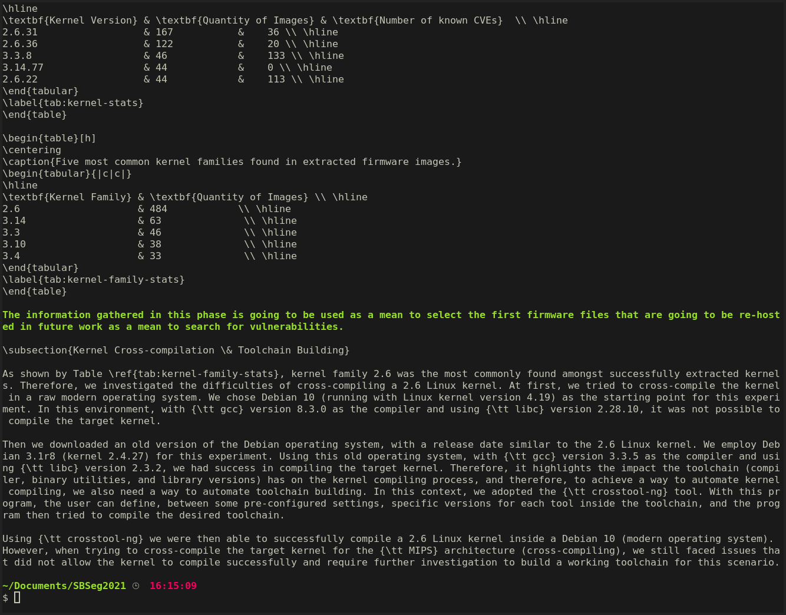

# Resultados

## Diff

## Before
\section{Results}
\label{sec:results}

When considering the analysis on a large scale, one can experience a wide range of heterogeneity in firmware components and operating systems.  Pragmatically, a full re-hosting by emulation is impossible by nature; then, discover the most common artifacts is crucial to steer efforts on porting components to QEMU.  In this Section, we realize the first step in the SCREEN re-hosting phase by identifying operating systems, architecture, and file systems. Then, we discuss the results obtained in firmware acquisition and firmware extraction. We improve Firmadyne performance (our baseline), serving as a demonstration of our approach.

\subsection{Firmware acquisition}

For the firmware acquisition, we used a fork of the Firmadyne's original scraper \cite{github:scraper}. This modified scraper version has fixed some compatibility issues the original scraper has with Python 3 and also updates the spiders to match the more updated version of vendor websites. Without modifying any of the spiders provided by the scraper, we selected five vendors (these five vendors were selected at random, as a mean to start the research, but the final goal is to use all available vendors within the scraper) and executed the scraper to find and download firmware from these vendors' websites automatically. In total, we downloaded 5265 firmware images throughout this process. Table \ref{tab:scraper} shows the number of firmware images and its combined file size for each vendor.

\begin{table}[h]
\centering
\caption{Downloaded firmware images per vendor}
\begin{tabular}{|c|c|c|}
\hline
\textbf{Vendor} & \textbf{Firmware Images} & \textbf{Combined File Size} \\ \hline
Netgear         & 3122                     & 93 GB                       \\ \hline
TP-Link         & 1320                     & 10 GB                       \\ \hline
D-Link          & 430                      & 6.7 GB                      \\ \hline
Ubiquiti        & 226                      & 20 GB                       \\ \hline
Tenda           & 167                      & 1 GB                        \\ \hline
\end{tabular}
\label{tab:scraper}
\end{table}

As this work's goal is towards re-hosting, this amount of firmware images is already enough for initial experiments with automated re-hosting. Notwithstanding, we can explore more vendors' pages and update scraper's spiders if we judge there is a need for a larger volume of firmware images.

\subsection{Firmware extraction}

The {\tt binwalk} tool plays an essential role in our firmware extraction process,
% and tightly by a script provided by Firmadyne \cite{firmadyne}
executed with a firmware image as a parameter, recursively tries to extract files using {\tt binwalk} for this purpose. It defines a breadth and depth limit to this recursion strategy. During the extraction process, the script then tries to identify if any of the extracted directories has a Linux root directory structure (i.e. has {\tt /bin}, {\tt /etc}, {\tt /usr} directories and so on). In this case, the filesystem structure is compressed and stored separately (also defined as a parameter to the script). The Firmadyne successful extraction rate was 51.17\% of the total amount of firmware (2694 images). Of these extracted images, 48.52\% (1307 images) had the filesystem extracted, and of these, 83.55\% (1092 images) had the architecture identified. Architecture identification is made by reading files in filesystem directories that should contain binary files (e.g. {\tt /bin} or {\tt /sbin}) and reading the header of these files.

Kernel detection is done by reading each entry identified by {\tt binwalk} in the extraction process and detecting known kernel types. These are also extracted and stored in a separate location. When using the script, the user has the option to disable kernel extraction, as this dramatically improves execution speed since {\tt binwalk} spends much effort in the extraction process. If kernel extraction is not disabled by the user, then the script also tries to identify the kernel version and store this information in Firmadyne's database if found.

As this process is incapable of identifying all kernels, we also developed an additional script that uses regular expressions to search the extracted filesystem of each firmware image with a non identified kernel during extraction and for directories that could reveal kernel version (e.g. {\tt /lib/modules/2.6.31} is an indication that this image contains a 2.6.31 Linux kernel). This search is swift compared to the filesystem extraction process and increased the number of kernel versions detected. Initially, with the Firmadyne's original extraction script, 983 kernels were identified amongst the 2694 (36.49\%) of the total amount of firmware images. However, after running the described heuristics to determine kernel version from the filesystem, the number of identified kernels increased to 1169 (18.92\% greater). Figure \ref{fig:stats-funnel} illustrates this success funnel for firmware image extraction in a bar chart.

\begin{figure}[h]
    \centering
    \includegraphics[width=0.90\textwidth]{figs/Funnel.png}
    \caption{Success funnel for firmware image extraction.}
    \label{fig:stats-funnel}
\end{figure}

It was also identified two issues in the extraction process. First, we observed incorrect identification in some kernel image media types (formerly known as MIME types) as a type on the extraction script denylist, which is easily corrected by excluding the identified type from the denylist. The second issue is related to the recursive extraction process. The limits in breadth and depth exploration allow the {\tt binwalk} tool to have functional performance, but in some cases, these limits were, in fact, responsible for the firmware extraction to be unsuccessful. Therefore, we believe in using a heuristic to select files with the most potential to hold firmware kernel or filesystem to be extracted next. This way, we can still have breadth and depth limits to maintain the extraction process feasibly, but it would also focus the extraction in more prominent files. Unfortunately, this approach of using heuristics, although idealized, was not yet implemented in our work.

Another enhancement we developed to the extraction process was the ability to extract additional kernel information. During kernel extraction, we scanned the kernel binary file for ASCII strings. From this search result, we then extract kernel banner (a string containing kernel version, compiler version used during kernel compilation, compilation date, and email of the developer who compiled the kernel) or identify, for instance, if the extracted system refers to an OpenWrt Linux. We store these additional pieces of information in Firmadyne's database, which had its schema altered to contain a new column to store the extra information for a given firmware image.

% Falar das estatísticas; Colocar tabela com as estatísticas

\subsubsection{Statistics}

Regarding firmware extraction and feature identification, we collected some statistics that may help the following steps of this work in kernel compilation and firmware re-hosting. Table \ref{tab:arch-stats} shows the amount of firmware detected for each architecture identified. Tables \ref{tab:kernel-stats} and \ref{tab:kernel-family-stats} shows the five most common kernel versions and kernel families respectively. Also, Table \ref{tab:kernel-stats} shows the number of known CVEs for each kernel version. The number of known CVEs was extracted from the CVE Details \cite{cvedetails} database \footnote{For some kernel versions, the {\tt www.cvedetails.com} database contains repeated entries with a different number of known CVEs. The biggest number for each repeated version was chosen.}. For architectures and kernel families, we couldn't find a way to easily extract the number of known vulnerabilities from open sources of information.

\begin{table}[h]
\centering
\caption{Number of images identified for each found architecture}
\begin{tabular}{|c|c|}
\hline
\textbf{Architecture} & \textbf{Quantity of Images} \\ \hline
{\tt mipseb}                & 485                         \\ \hline
{\tt armel}                 & 336                         \\ \hline
{\tt mipsel}                & 249                         \\ \hline
{\tt mips64eb}              & 11                          \\ \hline
{\tt ppceb}                 & 10                          \\ \hline
{\tt intel64el}             & 1                           \\ \hline
\end{tabular}
\label{tab:arch-stats}
\end{table}

\begin{table}[h]
\centering
\caption{Five most common kernel versions found in extracted firmware images and number of known CVEs for each version.}
\begin{tabular}{|c|c|c|}
\hline
\textbf{Kernel Version} & \textbf{Quantity of Images} & \textbf{Number of known CVEs}  \\ \hline
2.6.31                  & 167           &    36 \\ \hline
2.6.36                  & 122           &    20 \\ \hline
3.3.8                   & 46            &    133 \\ \hline
3.14.77                 & 44            &    0 \\ \hline
2.6.22                  & 44            &    113 \\ \hline
\end{tabular}
\label{tab:kernel-stats}
\end{table}

\begin{table}[h]
\centering
\caption{Five most common kernel families found in extracted firmware images.}
\begin{tabular}{|c|c|}
\hline
\textbf{Kernel Family} & \textbf{Quantity of Images} \\ \hline
2.6                    & 484            \\ \hline
3.14                   & 63              \\ \hline
3.3                    & 46              \\ \hline
3.10                   & 38              \\ \hline
3.4                    & 33              \\ \hline
\end{tabular}
\label{tab:kernel-family-stats}
\end{table}

\subsection{Kernel Cross-compilation \& Toolchain Building}

As shown by Table \ref{tab:kernel-family-stats}, kernel family 2.6 was the most commonly found amongst successfully extracted kernels. Therefore, we investigated the difficulties of cross-compiling a 2.6 Linux kernel. At first, we tried to cross-compile the kernel in a raw modern operating system. We chose Debian 10 (running with Linux kernel version 4.19) as the starting point for this experiment. In this environment, with {\tt gcc} version 8.3.0 as the compiler and using {\tt libc} version 2.28.10, it was not possible to compile the target kernel.

Then we downloaded an old version of the Debian operating system, with a release date similar to the 2.6 Linux kernel. We employ Debian 3.1r8 (kernel 2.4.27) for this experiment. Using this old operating system, with {\tt gcc} version 3.3.5 as the compiler and using {\tt libc} version 2.3.2, we had success in compiling the target kernel. Therefore, it highlights the impact the toolchain (compiler, binary utilities, and library versions) has on the kernel compiling process, and therefore, to achieve a way to automate kernel compiling, we also need a way to automate toolchain building. In this context, we adopted the {\tt crosstool-ng} tool. With this program, the user can define, between some pre-configured settings, specific versions for each tool inside the toolchain, and the program then tried to compile the desired toolchain.

Using {\tt crosstool-ng} we were then able to successfully compile a 2.6 Linux kernel inside a Debian 10 (modern operating system). However, when trying to cross-compile the target kernel for the {\tt MIPS} architecture (cross-compiling), we still faced issues that did not allow the kernel to compile successfully and require further investigation to build a working toolchain for this scenario.

## After
\section{Results}
\label{sec:results}

When considering the analysis on a large scale, one can experience a wide range of heterogeneity in firmware components and operating systems.  Pragmatically, a full re-hosting by emulation is impossible by nature; then, discover the most common artifacts is crucial to steer efforts on porting components to QEMU.  In this Section, we realize the first step in the SCREEN re-hosting phase by identifying operating systems, architecture, and file systems. Then, we discuss the results obtained in firmware acquisition and firmware extraction. We improve Firmadyne performance (our baseline), serving as a demonstration of our approach.

\subsection{Firmware acquisition}

For the firmware acquisition, we used a fork of the Firmadyne's original scraper \cite{github:scraper}. This modified scraper version has fixed some compatibility issues the original scraper has with Python 3 and also updates the spiders to match the more updated version of vendor websites. Without modifying any of the spiders provided by the scraper, we selected five vendors (these five vendors were selected at random, as a mean to start the research, but the final goal is to use all available vendors within the scraper) and executed the scraper to find and download firmware from these vendors' websites automatically. In total, we downloaded 5265 firmware images throughout this process. Table \ref{tab:scraper} shows the number of firmware images and its combined file size for each vendor.

\begin{table}[h]
\centering
\caption{Downloaded firmware images per vendor}
\begin{tabular}{|c|c|c|}
\hline
\textbf{Vendor} & \textbf{Firmware Images} & \textbf{Combined File Size} \\ \hline
Netgear         & 3122                     & 93 GB                       \\ \hline
TP-Link         & 1320                     & 10 GB                       \\ \hline
D-Link          & 430                      & 6.7 GB                      \\ \hline
Ubiquiti        & 226                      & 20 GB                       \\ \hline
Tenda           & 167                      & 1 GB                        \\ \hline
\end{tabular}
\label{tab:scraper}
\end{table}

As this work's goal is towards re-hosting, this amount of firmware images is already enough for initial experiments with automated re-hosting. Notwithstanding, we can explore more vendors' pages and update scraper's spiders if we judge there is a need for a larger volume of firmware images.

\subsection{Firmware extraction}

The {\tt binwalk} tool plays an essential role in our firmware extraction process,
% and tightly by a script provided by Firmadyne \cite{firmadyne}
executed with a firmware image as a parameter. To start the extraction process, we took advantage of an already implemented script within Firmadyne \cite{firmadyne} that recursively tries to extract files using {\tt binwalk} for this purpose. It defines a breadth and depth limit to this recursion strategy. During the extraction process, the script then tries to identify if any of the extracted directories has a Linux root directory structure (i.e. has {\tt /bin}, {\tt /etc}, {\tt /usr} directories and so on). In this case, the filesystem structure is compressed and stored separately (also defined as a parameter to the script). The Firmadyne successful extraction rate was 51.17\% of the total amount of firmware (2694 images). Of these extracted images, 48.52\% (1307 images) had the filesystem extracted, and of these, 83.55\% (1092 images) had the architecture identified. Architecture identification is made by reading files in filesystem directories that should contain binary files (e.g. {\tt /bin} or {\tt /sbin}) and reading the header of these files.

Kernel detection is done by reading each entry identified by {\tt binwalk} in the extraction process and detecting known kernel types. These are also extracted and stored in a separate location. When using the script, the user has the option to disable kernel extraction, as this dramatically improves execution speed since {\tt binwalk} spends much effort in the extraction process. If kernel extraction is not disabled by the user, then the script also tries to identify the kernel version and store this information in a database.

As this process is incapable of identifying all kernels, we also developed an additional script that uses regular expressions to search the extracted filesystem of each firmware image with a non identified kernel during extraction and for directories that could reveal kernel version (e.g. {\tt /lib/modules/2.6.31} is an indication that this image contains a 2.6.31 Linux kernel). This search is swift compared to the filesystem extraction process and increased the number of kernel versions detected. Initially, with the Firmadyne's original extraction script, 983 kernels were identified amongst the 2694 (36.49\%) of the total amount of firmware images. However, after running the described heuristics to determine kernel version from the filesystem, the number of identified kernels increased to 1169 (18.92\% greater). Figure \ref{fig:stats-funnel} illustrates this success funnel for firmware image extraction in a bar chart.

\begin{figure}[h]
    \centering
    \includegraphics[width=0.90\textwidth]{figs/Funnel.png}
    \caption{Success funnel for firmware image extraction.}
    \label{fig:stats-funnel}
\end{figure}

It was also identified two issues in the extraction process. First, we observed incorrect identification in some kernel image media types (formerly known as MIME types) as a type on the extraction script denylist, which is easily corrected by excluding the identified type from the denylist. The second issue is related to the recursive extraction process. The limits in breadth and depth exploration allow the {\tt binwalk} tool to have functional performance, but in some cases, these limits were, in fact, responsible for the firmware extraction to be unsuccessful. Therefore, we believe in using a heuristic to select files with the most potential to hold firmware kernel or filesystem to be extracted next. This way, we can still have breadth and depth limits to maintain the extraction process feasibly, but it would also focus the extraction in more prominent files. Unfortunately, this approach of using heuristics, although idealized, was not yet implemented in our work.

Another enhancement we developed to the extraction process was the ability to extract additional kernel information. During kernel extraction, we scanned the kernel binary file for ASCII strings. From this search result, we then extract kernel banner (a string containing kernel version, compiler version used during kernel compilation, compilation date, and email of the developer who compiled the kernel) or identify, for instance, if the extracted system refers to an OpenWrt Linux. We store these additional pieces of information in a database. The database we implemented was also based on the database used by Firmadyne, but we had its schema altered to contain new columns to store the extra information we decided to collect.

% Falar das estatísticas; Colocar tabela com as estatísticas

\subsubsection{Statistics}

Regarding firmware extraction and feature identification, we collected some statistics that may help the following steps of this work in kernel compilation and firmware re-hosting. Table \ref{tab:arch-stats} shows the amount of firmware detected for each architecture identified. Tables \ref{tab:kernel-stats} and \ref{tab:kernel-family-stats} shows the five most common kernel versions and kernel families respectively. Also, Table \ref{tab:kernel-stats} shows the number of known CVEs for each kernel version. The number of known CVEs was extracted from the CVE Details \cite{cvedetails} database \footnote{For some kernel versions, the {\tt www.cvedetails.com} database contains repeated entries with a different number of known CVEs. The biggest number for each repeated version was chosen.}. For architectures and kernel families, we couldn't find a way to easily extract the number of known vulnerabilities from open sources of information.

\begin{table}[h]
\centering
\caption{Number of images identified for each found architecture}
\begin{tabular}{|c|c|}
\hline
\textbf{Architecture} & \textbf{Quantity of Images} \\ \hline
{\tt mipseb}                & 485                         \\ \hline
{\tt armel}                 & 336                         \\ \hline
{\tt mipsel}                & 249                         \\ \hline
{\tt mips64eb}              & 11                          \\ \hline
{\tt ppceb}                 & 10                          \\ \hline
{\tt intel64el}             & 1                           \\ \hline
\end{tabular}
\label{tab:arch-stats}
\end{table}

\begin{table}[h]
\centering
\caption{Five most common kernel versions found in extracted firmware images and number of known CVEs for each version.}
\begin{tabular}{|c|c|c|}
\hline
\textbf{Kernel Version} & \textbf{Quantity of Images} & \textbf{Number of known CVEs}  \\ \hline
2.6.31                  & 167           &    36 \\ \hline
2.6.36                  & 122           &    20 \\ \hline
3.3.8                   & 46            &    133 \\ \hline
3.14.77                 & 44            &    0 \\ \hline
2.6.22                  & 44            &    113 \\ \hline
\end{tabular}
\label{tab:kernel-stats}
\end{table}

\begin{table}[h]
\centering
\caption{Five most common kernel families found in extracted firmware images.}
\begin{tabular}{|c|c|}
\hline
\textbf{Kernel Family} & \textbf{Quantity of Images} \\ \hline
2.6                    & 484            \\ \hline
3.14                   & 63              \\ \hline
3.3                    & 46              \\ \hline
3.10                   & 38              \\ \hline
3.4                    & 33              \\ \hline
\end{tabular}
\label{tab:kernel-family-stats}
\end{table}

The information gathered in this phase is going to be used as a mean to select the first firmware files that are going to be re-hosted in future work as a mean to search for vulnerabilities.

\subsection{Kernel Cross-compilation \& Toolchain Building}

As shown by Table \ref{tab:kernel-family-stats}, kernel family 2.6 was the most commonly found amongst successfully extracted kernels. Therefore, we investigated the difficulties of cross-compiling a 2.6 Linux kernel. At first, we tried to cross-compile the kernel in a raw modern operating system. We chose Debian 10 (running with Linux kernel version 4.19) as the starting point for this experiment. In this environment, with {\tt gcc} version 8.3.0 as the compiler and using {\tt libc} version 2.28.10, it was not possible to compile the target kernel.

Then we downloaded an old version of the Debian operating system, with a release date similar to the 2.6 Linux kernel. We employ Debian 3.1r8 (kernel 2.4.27) for this experiment. Using this old operating system, with {\tt gcc} version 3.3.5 as the compiler and using {\tt libc} version 2.3.2, we had success in compiling the target kernel. Therefore, it highlights the impact the toolchain (compiler, binary utilities, and library versions) has on the kernel compiling process, and therefore, to achieve a way to automate kernel compiling, we also need a way to automate toolchain building. In this context, we adopted the {\tt crosstool-ng} tool. With this program, the user can define, between some pre-configured settings, specific versions for each tool inside the toolchain, and the program then tried to compile the desired toolchain.

Using {\tt crosstool-ng} we were then able to successfully compile a 2.6 Linux kernel inside a Debian 10 (modern operating system). However, when trying to cross-compile the target kernel for the {\tt MIPS} architecture (cross-compiling), we still faced issues that did not allow the kernel to compile successfully and require further investigation to build a working toolchain for this scenario.