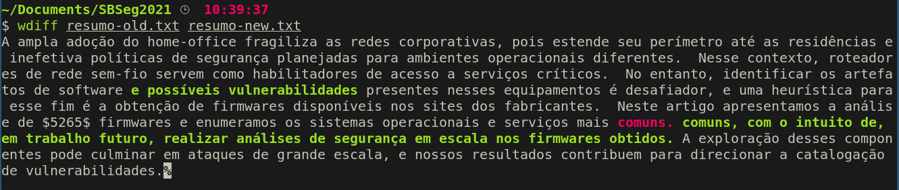

# Resumo

## Diff

## Before (EN)
The widespread adoption of the home office weakens corporate networks, as it extends its perimeter to homes and ineffective security policies designed for different operating environments. In this context, wireless network routers serve as enablers of access to critical services. However, identifying the software artifacts present on these devices is challenging, and a heuristic for this purpose is to obtain firmware available on the manufacturers' websites. This paper presents the analysis of $5265$ downloaded from $5$ vendors' sites, yielding a list of the most common operating systems and services. The exploitation of these components can lead to large-scale attacks, and our results contribute to the vulnerability cataloging process.

## Before (PT-BR)
A ampla adoção do home-office fragiliza as redes corporativas, pois estende seu perímetro até as residências e inefetiva políticas de segurança planejadas para ambientes operacionais diferentes.  Nesse contexto, roteadores de rede sem-fio servem como habilitadores de acesso a serviços críticos.  No entanto, identificar os artefatos de software presentes nesses equipamentos é desafiador, e uma heurística para esse fim é a obtenção de firmwares disponíveis nos sites dos fabricantes.  Neste artigo apresentamos a análise de $5265$ firmwares e enumeramos os sistemas operacionais e serviços mais comuns.  A exploração desses componentes pode culminar em ataques de grande escala, e nossos resultados contribuem para direcionar a catalogação de vulnerabilidades.

## After (EN)
The widespread adoption of the home office weakens corporate networks, as it extends its perimeter to homes and ineffective security policies designed for different operating environments. In this context, wireless network routers serve as enablers of access to critical services. However, identifying the software artifacts and possible vulnerabilities present on these devices is challenging, and a heuristic for this purpose is to obtain firmware available on the manufacturers' websites. This paper presents the analysis of $5265$ firmware images downloaded from $5$ vendors' sites, yielding a list of the most common operating systems and services, with the intent of, in a future work, perform security analysis in scale on the obtained firmware images. The exploitation of these components can lead to large-scale attacks, and our results contribute to the vulnerability cataloging process.

## After (PT-BR)
A ampla adoção do home-office fragiliza as redes corporativas, pois estende seu perímetro até as residências e inefetiva políticas de segurança planejadas para ambientes operacionais diferentes.  Nesse contexto, roteadores de rede sem-fio servem como habilitadores de acesso a serviços críticos.  No entanto, identificar os artefatos de software e possíveis vulnerabilidades presentes nesses equipamentos é desafiador, e uma heurística para esse fim é a obtenção de firmwares disponíveis nos sites dos fabricantes.  Neste artigo apresentamos a análise de $5265$ firmwares e enumeramos os sistemas operacionais e serviços mais comuns, com o intuito de, em trabalho futuro, realizar análises de segurança em escala nos firmwares obtidos. A exploração desses componentes pode culminar em ataques de grande escala, e nossos resultados contribuem para direcionar a catalogação de vulnerabilidades.